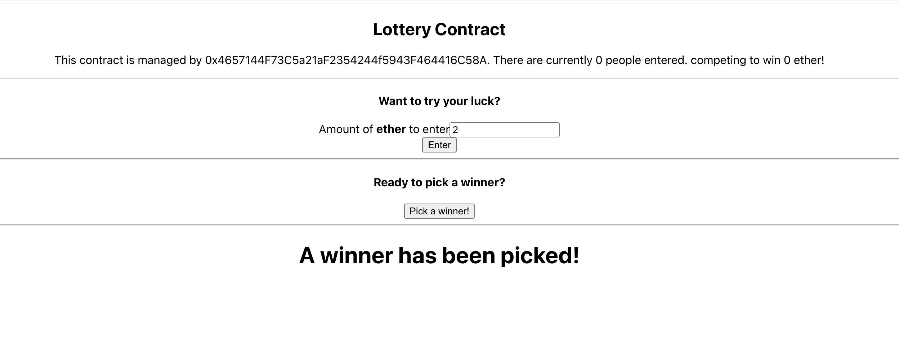

# Demo Lottery Blockchain with react


### configuration deploy (Project Blockchain)

- deploy.js (edit)

```

const privateKey = "YOUR_PRIVATE_KEY"
const infuraKey = "YOUR_KEY"


```

run

```

node deploy.js

```


### Aplication


- Config 1

```

Edit file abi.json

```


- Config 2 lottery.tsx


```
lottery.tsx add contract address

```


- Run 

```
 yarn start

```




